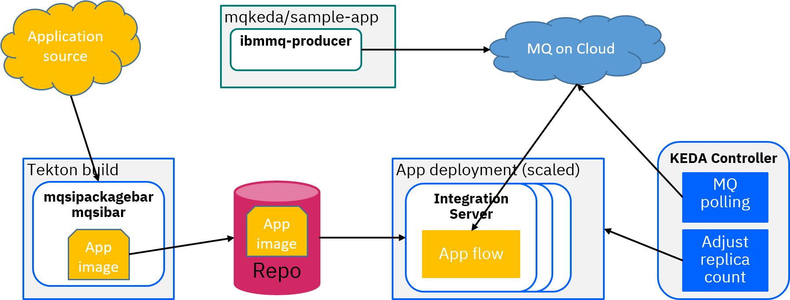
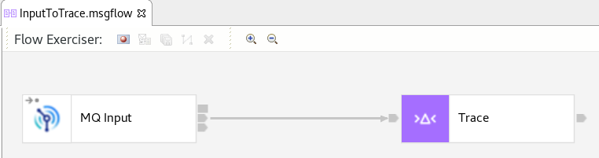

# ACE KEDA demo

Demonstration of automatic workload scaling (including scaling to zero) of App Connect Enterprise
(ACE) using [KEDA](https://keda.sh) to monitor the depth of an MQ queue.

Based on the MQ KEDA demo at https://github.com/ibm-messaging/mq-dev-patterns/tree/master/Go-K8s but using
an ACE flow instead of the MQ consumer application. The ACE application is a simple MQInput-based flow, and
the build pipeline is the ACE Maven/Tekton pipeline taken from https://github.com/ot4i/ace-demo-pipeline 
and modified.

## Scenario description

The original MQ KEDA demo used a pair of MQ applications in separate containers, with one putting and
the other getting MQ messages, and in this demo ACE replaces the consumer container, with the rest being
similar from a Keda point of view:



Tekton is used to build and deploy the ACE application container, while either the IBM MQ producer container
or another MQ client (including the "Create" button on a queue in the MQ on Cloud UI) are used to provide
messages. KEDA is configured to monitor the queue depth of the MQ on Cloud queue (DEMO.QUEUE in this case)
and scale the ACE consumer container appropriately.

The application containers use the ace-minimal image built using instructions (and Tekton build
artifacts) from https://github.com/ot4i/ace-demo-pipeline/tree/master/tekton/minimal-image-build

## Application description

The application reads messages from the queue and prints them to the server console:




## Building and running the demo

A Kubernetes cluster is needed along with a container registry and an MQ queue manager. These
can all be provisioned free of charge in the IBM Cloud, or existing infrastructure can be used.
See [README-cloud-resources.md](demo-infrastructure/README-cloud-resources.md) for instructions
explaining how to create the IBM Cloud resources.

### Installing KEDA

KEDA can be installed using the operator (most recent version tested is
RedHat's Custom Metrics Autoscaler 2.7.1 on OpenShift 4.12) or via kubectl:
```
kubectl apply -f https://github.com/kedacore/keda/releases/download/v2.9.2/keda-2.9.2.yaml
```

Update the keda/secrets.yaml to contain the correct MQ application and admin credentials
(currently blank) for use by the KEDA scaler. This file then needs to be applied (before 
the app container is created due to the issue referenced above) so that the queue depth 
polling succeeds, and the mq-secret must be create to allow the container to run:

```
kubectl apply -f keda/secrets.yaml
kubectl create secret generic mq-secret --from-literal=USERID='app user' --from-literal=PASSWORD='app key' --from-literal=hostName='mqoc-fd48.qm.us-south.mq.appdomain.cloud' --from-literal=portNumber='31361'
```

### Building the ACE app

See the [tekton README](tekton/README.md) for build instructions, including building the
ace-minimal containers.

Once the build has succeeded, modify keda/keda-configuration.yaml to contain the correct
credentials and communication paremeters, and then apply the file to enable scaling for
the ace-keda-demo container:
```
kubectl apply -f keda/keda-configuration.yaml
```

Messages can be sent via the MQ on Cloud console, or by using the mqkeda producer container:
```
kubectl apply -f keda/deploy-producer.yaml
```

Monitor using the Kube console to inspect the number of pods for the deployment, or else use 
kubectl to show the number of replicas increasing and decreasing based on queue depth:
```
root@9ddf9a517959:/# kubectl get hpa -w
keda-hpa-ace-keda-demo   Deployment/ace-keda-demo   0/2 (avg)           1         5         4          65m
keda-hpa-ace-keda-demo   Deployment/ace-keda-demo   <unknown>/2 (avg)   1         5         0          65m
keda-hpa-ace-keda-demo   Deployment/ace-keda-demo   5/2 (avg)           1         5         1          66m
keda-hpa-ace-keda-demo   Deployment/ace-keda-demo   0/2 (avg)           1         5         4          66m
keda-hpa-ace-keda-demo   Deployment/ace-keda-demo   <unknown>/2 (avg)   1         5         0          67m
keda-hpa-ace-keda-demo   Deployment/ace-keda-demo   7/2 (avg)           1         5         1          67m
```

## Common errors

Examining the KEDA operator pod logs can often provide a clue if unexpected behaviour occurs.

### Error 'Format:"DecimalSI"}: must be positive' in operator logs

Setting the `queueDepth` parameter to zero in recent KEDA versions leads to errors when
creating the HorizontalPodAutoscaler (HPA) definition:

```
2023-02-22T14:39:10Z ERROR controller.scaledobject Failed to create new HPA in cluster
{"reconciler group": "keda.sh", "reconciler kind": "ScaledObject", "name": "ace-keda-demo",
"namespace": "default", "HPA.Namespace": "default", "HPA.Name": "keda-hpa-ace-keda-demo",
"error": "HorizontalPodAutoscaler.autoscaling \"keda-hpa-ace-keda-demo\" is invalid:
 spec.metrics[0].external.target.averageValue: Invalid value: resource.Quantity{i:resource.int64Amount{value:0,
 scale:0}, d:resource.infDecAmount{Dec:(*inf.Dec)(nil)}, s:\"0\", Format:\"DecimalSI\"}: must be positive"}
```
or
```
2023-02-22T14:39:10Z ERROR controller.scaledobject Failed to ensure HPA is correctly created
for ScaledObject {"reconciler group": "keda.sh", "reconciler kind": "ScaledObject",
"name": "ace-keda-demo", "namespace": "default", "error": "HorizontalPodAutoscaler.autoscaling 
\"keda-hpa-ace-keda-demo\" is invalid: spec.metrics[0].external.target.averageValue: Invalid value:
 resource.Quantity{i:resource.int64Amount{value:0, scale:0}, d:resource.infDecAmount{Dec:(*inf.Dec)(nil)},
 s:\"0\", Format:\"DecimalSI\"}: must be positive"}
```

The solution is to set the queueDepth to a positive value, as this does not prevent scaling to zero.

### KEDA failing to authenticate to the MQ queue manager

Verify the credentials used, noting that the values in keda-secrets.yaml must be base64-encoded.
The values must be base64-encoded, and must not have encoded newlines; creating the encoded text
by running `echo` and `base64` can lead to this without it being obvious.

Running
```
echo "keda" | base64
```
will produce a valid base64 string of "a2VkYQo=" but this actually includes a newline and will
not work as expected when used for authentication.

Instead, run
```
echo -n "keda" | base64
```
which will produce "a2VkYQ==" (without a newline).

This problem can affect both usernames and passwords, and can be hard to spot.

### KEDA not using admin credentials correctly

For versions earlier than 2.4.0, issue https://github.com/kedacore/keda/issues/1938 means that the
admin credentials for the KEDA QM polling need to be attached to the application container. This is
unlikely to be the cause for recent KEDA versions, but may affect old installations.

## Startup time notes

The build uses the `ibmint optimize server` command to minimize the resources loaded when the server
starts up. Startup times are expected to take a few seconds, including the time take to connect to
(and authenticate to) the remote MQ queue manager.
