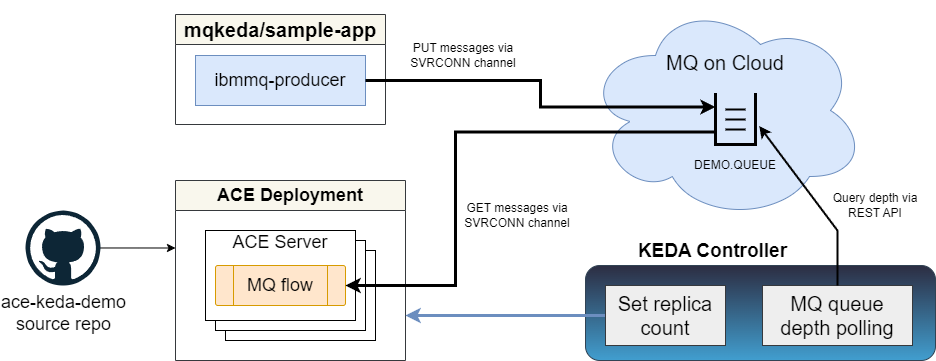

# ACE KEDA demo

Demonstration of automatic workload scaling (including scaling to zero) of App Connect Enterprise
(ACE) using [KEDA](https://keda.sh) to monitor the depth of an MQ queue.

Based on the MQ KEDA demo at https://github.com/ibm-messaging/mq-dev-patterns/tree/master/Go-K8s but using
an ACE flow instead of the MQ consumer application. The ACE application is a simple MQInput-based flow, and
the build pipeline is the ACE Maven/Tekton pipeline taken from https://github.com/ot4i/ace-demo-pipeline 
and modified.

## Scenario description

The original MQ KEDA demo used a pair of MQ applications in separate containers, with one putting and
the other getting MQ messages, and in this demo ACE replaces the consumer container, with the rest being
similar from a Keda point of view:



Tekton is used to build and deploy the ACE application container, while either the IBM MQ producer container
or another MQ client (including the "Create" button on a queue in the MQ on Cloud UI) are used to provide
messages. KEDA is configured to monitor the queue depth of the MQ on Cloud queue (DEMO.QUEUE in this case)
and scale the ACE consumer container appropriately.

The application containers use the ace-minimal-mqclient image built from 
https://github.com/trevor-dolby-at-ibm-com/ace-docker/blob/main/experimental/README.md but KEDA can 
also control CP4i ACE containers via the IntegrationRuntime (see below for details).


## Application description

The application reads messages from the queue and prints them to the server console:


## Building and running the demo

A Kubernetes cluster is needed along with a container registry and an MQ queue manager.
[Minikube](https://minikube.sigs.k8s.io/docs/) (easily installed locally) and OpenShift 
can be used to provide the cluster and registry (external registries can also be used), while
MQ on Cloud can be provisioned free of charge in the IBM Cloud, or existing infrastructure 
can be used. See [README-cloud-resources.md](demo-infrastructure/README-cloud-resources.md) 
for instructions explaining how to create the IBM Cloud resources.

### Installing KEDA

KEDA can be installed using the operator (most recent version tested is
RedHat's Custom Metrics Autoscaler 2.14.1 on OpenShift 4.16) or via kubectl:
```
kubectl apply --server-side -f https://github.com/kedacore/keda/releases/download/v2.16.1/keda-2.16.1.yaml
```
(Note that `--server-side` is needed to avoid errors saying `The CustomResourceDefinition "scaledjobs.keda.sh" 
is invalid: metadata.annotations: Too long: must have at most 262144 bytes`)

Create the `keda-ibmmq-secret` for use by KEDA in polling the MQ REST API and the `mq-secret`
for the ACE container to use:

```
kubectl create secret generic keda-ibmmq-secret --from-literal=ADMIN_USER='admin' --from-literal=ADMIN_PASSWORD='passw0rd'
kubectl create secret generic mq-secret --from-literal=USERID='app user' --from-literal=PASSWORD='app key' --from-literal=hostName='mqoc-fd48.qm.us-south.mq.appdomain.cloud' --from-literal=portNumber='31247'
```
These could be merged into one, but in most cases the ACE server and the KEDA scaler itself will
be running with different credentials (possibly in different namespaces) so using two secrets in
this demo keeps the separation of concerns.

### TLS and MQ

MQ on Cloud is an easy way to experiment with KEDA, but MQ in containers now supports the use of 
the MQ REST API and KEDA can poll the queue depth in the same way it does with MQ on Cloud. Setting 
up TLS can be challenging unless the queue manager REST API uses a certificate issued by a 
well-known CA; testing has been completed using version 3.3.0 of the MQ operator with MQ 9.4.0.6.

TLS connectivity can be checked with curl as follows:
```
 curl -u admin:passw0rd -X POST --data '{"type": "runCommand", "parameters": {"command": "DIS QL(*)"}}' -H "ibm-mq-rest-csrf-token: abc" -H "Content-Type: application/json" -k -v https://qm-dev-ibm-mq-web-ace-keda.apps.openshift-20240503.dolbyfamily.org/ibmmq/rest/v3/admin/action/qmgr/QUICKSTART/mqsc
 ```

The ACE application container is configured to avoid MQ certificate validation (see 
[demo-infrastructure/mqclient.ini](/demo-infrastructure/mqclient.ini)) and also to send 
the hostname as the SNI data when connecting; while avoiding validation is not recommended
for production, this repo is intended to show how to use ACE with KEDA and so TLS setup
is less critical.

Note that KEDA versions earlier than v2.16.1 (the latest tested) may have issues connecting
to queue managers with self-signed certificates. Current KEDA levels support setting
```
        unsafeSsl: "true"
```
in the ScaledObject configuration, but earlier releases had some issues using this setting.

### Building the ACE app

See the [tekton README](tekton/README.md) for build instructions, including building the
ace-minimal-mqclient containers.

Once the build has succeeded and the application is receiving messages as expected, modify
[keda/keda-configuration.yaml](keda/keda-configuration.yaml) to contain the correct credentials 
and communication paremeters, and then apply the file to enable scaling for the ace-keda-demo container:
```
kubectl apply -f keda/keda-configuration.yaml
```

Messages can be sent via the MQ on Cloud console, or by using the mqkeda producer container:
```
kubectl apply -f keda/deploy-producer.yaml
```

Monitor using the Kube console to inspect the number of pods for the deployment, or else use 
kubectl to show the number of replicas increasing and decreasing based on queue depth:
```
root@9ddf9a517959:/# kubectl get hpa -w
keda-hpa-ace-keda-demo   Deployment/ace-keda-demo   0/2 (avg)           1         5         4          65m
keda-hpa-ace-keda-demo   Deployment/ace-keda-demo   <unknown>/2 (avg)   1         5         0          65m
keda-hpa-ace-keda-demo   Deployment/ace-keda-demo   5/2 (avg)           1         5         1          66m
keda-hpa-ace-keda-demo   Deployment/ace-keda-demo   0/2 (avg)           1         5         4          66m
keda-hpa-ace-keda-demo   Deployment/ace-keda-demo   <unknown>/2 (avg)   1         5         0          67m
keda-hpa-ace-keda-demo   Deployment/ace-keda-demo   7/2 (avg)           1         5         1          67m
```

## Cloud Pak for Integration (CP4i) ACE operator

KEDA assumes that it is scaling Kubernetes Deployments, but this approach will not work when
scaling servers managed by the ACE operator using IntegrationRuntime or IntegrationServer
custom resources (CRs). Although KEDA can change the number of replicas in the Deployment, 
the operator will be trying to ensure the Deployment for the server matches the CR, and so
it will change the replica setting back to the CR-provided value.

The solution is to scale the CR itself rather than the Deployment. Both IntegrationRuntime and
IntegrationServer provide the correct interfaces to enable KEDA to set the number of replicas,
and the only change required is to the `scaleTargetRef` in the KEDA configuration. Instead of
```
  scaleTargetRef:
    name: ace-keda-demo
```
the CR can be specified instead, as follows for IntegrationRuntimes:
```
  scaleTargetRef:
    apiVersion: appconnect.ibm.com/v1beta1
    kind: IntegrationRuntime
    name: ir-01-quickstart
```
and for IntegrationServer CRs:
```
  scaleTargetRef:
    apiVersion: appconnect.ibm.com/v1beta1
    kind: IntegrationServer
    name: is-01-consumemq
```

## Common errors

Examining the KEDA operator pod logs can often provide a clue if unexpected behaviour occurs.

### Error 'Format:"DecimalSI"}: must be positive' in operator logs

Setting the `queueDepth` parameter to zero in recent KEDA versions leads to errors when
creating the HorizontalPodAutoscaler (HPA) definition:

```
2023-02-22T14:39:10Z ERROR controller.scaledobject Failed to create new HPA in cluster
{"reconciler group": "keda.sh", "reconciler kind": "ScaledObject", "name": "ace-keda-demo",
"namespace": "default", "HPA.Namespace": "default", "HPA.Name": "keda-hpa-ace-keda-demo",
"error": "HorizontalPodAutoscaler.autoscaling \"keda-hpa-ace-keda-demo\" is invalid:
 spec.metrics[0].external.target.averageValue: Invalid value: resource.Quantity{i:resource.int64Amount{value:0,
 scale:0}, d:resource.infDecAmount{Dec:(*inf.Dec)(nil)}, s:\"0\", Format:\"DecimalSI\"}: must be positive"}
```
or
```
2023-02-22T14:39:10Z ERROR controller.scaledobject Failed to ensure HPA is correctly created
for ScaledObject {"reconciler group": "keda.sh", "reconciler kind": "ScaledObject",
"name": "ace-keda-demo", "namespace": "default", "error": "HorizontalPodAutoscaler.autoscaling 
\"keda-hpa-ace-keda-demo\" is invalid: spec.metrics[0].external.target.averageValue: Invalid value:
 resource.Quantity{i:resource.int64Amount{value:0, scale:0}, d:resource.infDecAmount{Dec:(*inf.Dec)(nil)},
 s:\"0\", Format:\"DecimalSI\"}: must be positive"}
```

The solution is to set the queueDepth to a positive value, as this does not prevent scaling to zero.

### KEDA failing to authenticate to the MQ queue manager

Verify the credentials used, ensuring that the correct credentials have been placed in the different secrets,
and that the KEDA credentials have permission to use the MQ REST API.

### KEDA not using admin credentials correctly

For versions earlier than 2.4.0, issue https://github.com/kedacore/keda/issues/1938 means that the
admin credentials for the KEDA QM polling need to be attached to the application container. This is
unlikely to be the cause for recent KEDA versions, but may affect old installations.

## Startup time notes

The build uses the `ibmint optimize server` command to minimize the resources loaded when the server
starts up. Startup times are expected to take a few seconds, including the time taken to connect to
(and authenticate to) the remote MQ queue manager.
